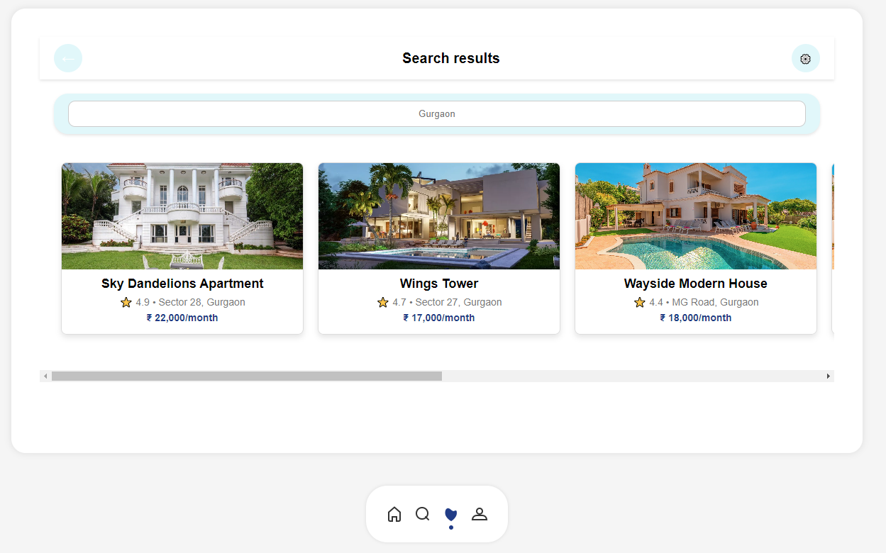
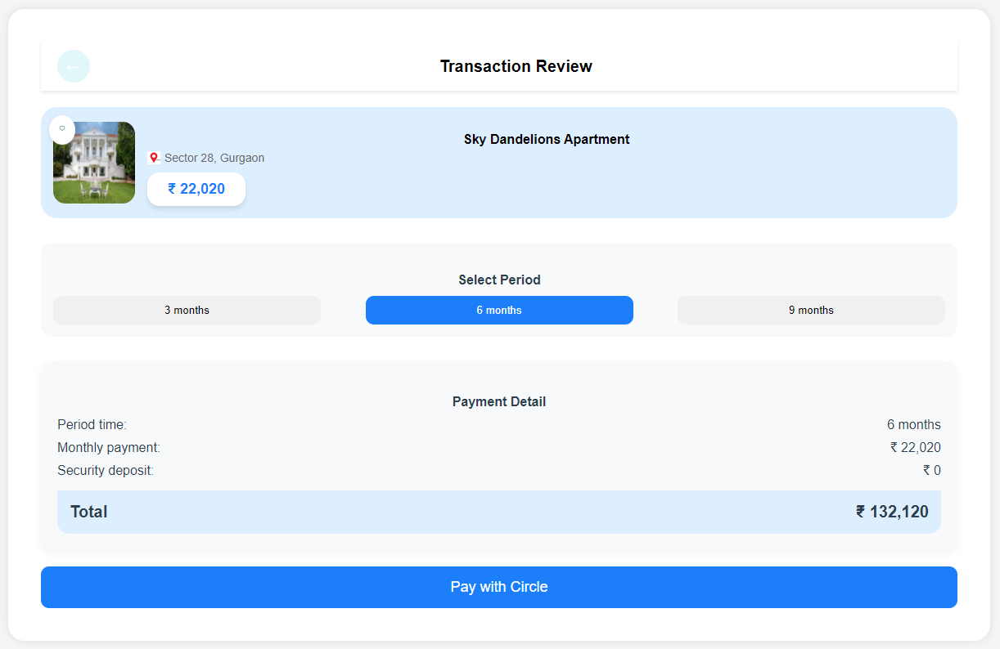
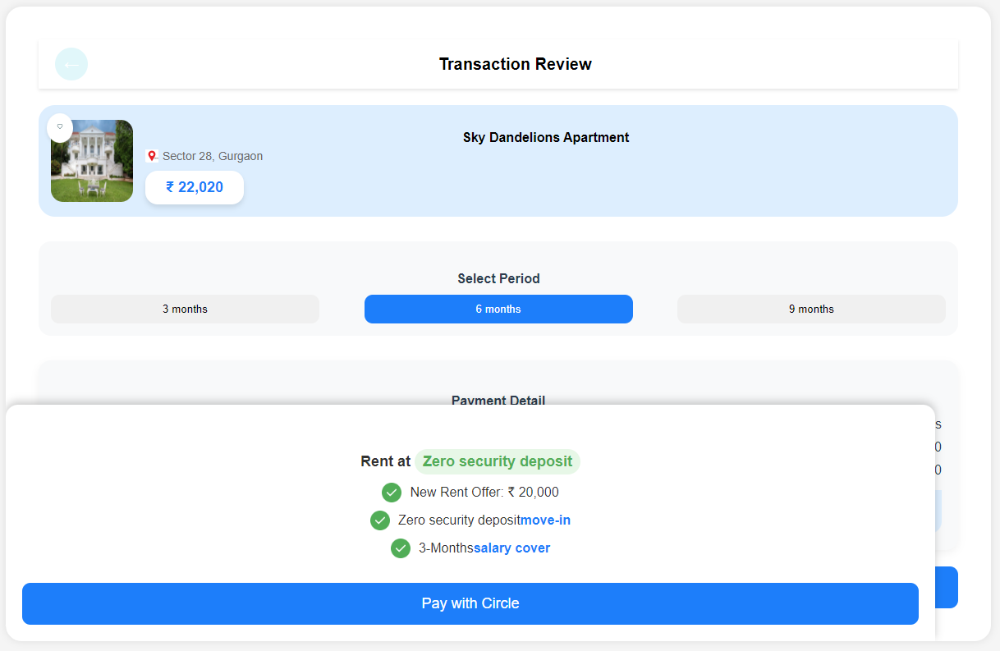
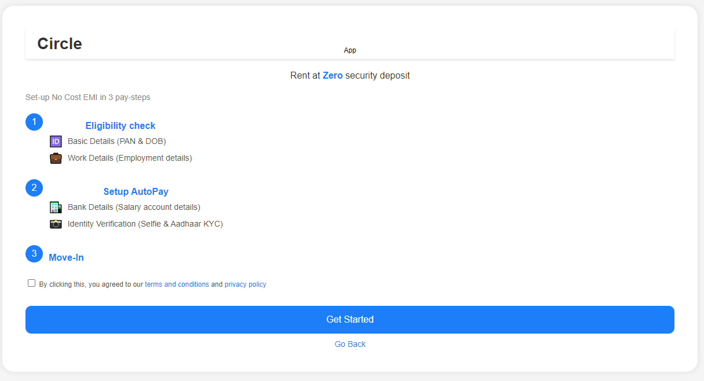

# Project Title 
This is a basic project for search and rent out the properties with zero deposit developed using HTML CSS and java script code.

User can search for the property, can explore for the details of the project.
User can select the desired propery and can avail it for rent by paying from the application.
User can also have option to choose the period for which the user want to pay the rent (i.e. 3months 6months, 9months).
user will get new rent offer
user eligibility will be checked 
tools used are html,css,css tailwind,javascript .
technologies used are customer relationship management ,communication tools , machinelearning and AI.
challenges faced while making frontend project was that there was no img src url for pictures ,complex data visualization,cross-browser compatibility,user experience ,real time collaborations problem.
Use HTTPS, end-to-end encryption, and secure authentication (OAuth 2.0, JWTs). Follow GDPR and CCPA compliance for data handling.
to overcome challenges first I found img that can be used it was a time taking process next was error handling in an efficient manner and i was able to make this project . 
I am still working on this project after submission to make it more responsive and functional .

